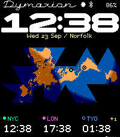
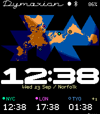

# Dymaxion

A flexible planetary watch face for **Pebble Time 2 / Emery**, with the original
concept's Dymaxion map, a full-width clock, and a browser layout workshop.


## On the watch

- Local time plus three independent clocks, with named IANA zones, daylight
  saving transitions, fractional-hour offsets, and date differences. A `+1`
  beside a zone means it is already tomorrow relative to the watch's local date;
  `−1` means yesterday, and the same date has no label.
- Explicit latitude/longitude for every place, with five small geometric map
  glyphs. Every place can have its own color, snapped to Pebble's 64-color grid.
  The local clock follows the watch; no location is guessed from an offset.
- Two horizontal compositions, Atlas and Horizon. The local clock fills 196 of
  200 pixels with rounded broad numerals and moves vertically;
  the map and places remain independently movable.
  Optional stacked hours/minutes retain the earlier display cut.
- A 400 ms minute transition: only changed triangular tiles hinge away to reveal
  the new time. Rounded corners, heavy strokes, and the bold colon remain crisp.
  Motion stops at 20% battery or when **Brief animations** is disabled.
  See [minute transitions](docs/MINUTE-FLIP.md).
- The earlier triangular seven-segment experiment remains available: six hexagonal
  edges and a raised waist, assembled from whole equilateral cells. Switch styles in
  **Character → Numerical display**. `/segment-study.html` lets you toggle each electrode.
- The clock caption names the current city, using the phone's location at most
  hourly, or a manual name. The workshop labels Norfolk as an example until you
  request a location preview. City lookup uses Photon / OpenStreetMap.
- A small optional 9×9-pixel lunar glyph in the top bar, with eight familiar phases.
- Solar day/night shading, a subsolar diamond, city lights and optional face edges.
- Fourteen RGB222 palettes, including **DaVinci**, **TWA**, **High Visibility**, **Monochrome**, **Blue & Amber**, **Teal & Rose**, **Amber Terminal**, and **Polar**. The six new palettes include matching bottom-panel colors and city glyphs, checked in color-vision simulations. Original **Dymaxion Span** clock numerals, **Draft** zone lettering, a seven-pixel Micro font, and a pixel-script nameplate. See [palette notes](docs/PALETTES.md).
- **Custom palettes** in Character and the phone configuration: copy any preset, edit colors with a live designer preview, and keep up to 12 named palettes. Colors include day/night map shades, lettering, indicators, default place colors, and chart/calendar defaults. Saved palettes travel with exported settings; the active colors persist on the watch.
- A typography study comparing Span, Draft, Alegreya Sans, Fira Sans, and Recursive at watch resolution, including lining and oldstyle figures where available.
- Five 5×5-pixel map glyphs in the Places tab: diamond, point, ring, triangle
  and plus. The place colors also carry through to the zone labels.
- A configurable 44-pixel bottom band: time zones, a weather chart, a two-week
  calendar, humidity and NOAA tide predictions. Choose the pages, their order,
  colors, units, chart scales and starting page in **Panels**.
- Optional deliberate shake to change panels, with a three-second cooldown.
  Shake sensing stops at 20% battery or below. Disable it for a fixed page or
  timed rotation using the existing minute tick. No tap or touch subscription.
- Brief marker pulses on launch/settings changes; real battery and a pixel
  Bluetooth connection indicator.
- Persistent configuration and an **offline phone settings page** included in
  the PBW. Hosting a website is not required to configure the watch.

| Atlas | Horizon |
| --- | --- |
|  |  |

## Try the workshop

Requires Node.js 20.19+ (tested with 24) and npm.

```sh
npm ci
npm run dev
```

Open the local URL printed by Vite. Drag components directly on the watch, or
select an element and set its x/y coordinates. Arrow keys move the selected
element one pixel; Shift moves five. The solar slider previews a different time
without changing the watch's actual clock. Settings are saved in this browser.

Use **Export settings** to save a JSON file. In the face's settings inside the
Pebble phone app, open **Import settings from the workshop** and select that
file (or paste its JSON). Save to watch. You can also configure the face entirely
in the offline phone page, including exact positions and custom coordinates.

```sh
npm run build                  # static workshop in dist/
```

`dist/` may be hosted at any static-site path; assets use relative URLs. The
browser preview uses the same map resources and time-zone database as the watch
companion. Battery/connection values in the browser are explicitly sample values.
Bottom charts initially use labeled examples. **Load live data** fetches weather
for a configured place and tides for the selected NOAA station. The phone
companion only sends real provider data. See [bottom panels](docs/PANELS.md) for
the chart conventions, station coverage, caching and interaction details.

## Build and run the native face

Install the [Pebble SDK](https://developer.repebble.com/sdk/). Resources and the
generated phone companion are checked in, so an ordinary native build needs no
root npm install or Python asset tooling:

```sh
cd watchface
pebble build
pebble install --emulator emery  # add --vnc in a headless environment
# Or use your phone's developer connection:
pebble install --phone <phone-ip>
```

The installable file is `watchface/build/watchface.pbw`. Target: Emery only,
200×228 pixels, 64 colors. SDK 4.33.1 reports 92,670 bytes of resources and a
62,845-byte static RAM footprint; the map bitmap adds about 22 KB of heap.

The project also remains compatible with opening the `watchface` folder in the
[Pebble Browser Emulator](https://github.com/huntrontrakkr/pebble-browser-emulator).
That browser emulator integration has not been exercised in this revision.

## Development and verification

```sh
npm ci
npx playwright install chromium
npm run generate              # map, markers, palette, status, triangular display, defaults
node tools/generate-chart-axis.mjs # compact chart numerals and layout constants
npm run generate:clock        # rounded pixel masters and native minute-flip geometry
npm run companion             # phone bundle, including offline configuration HTML
npm test                      # projection, DST, solar, providers, native packets/calendar/shake
npm run dev                   # keep running in another terminal
npm run test:browser          # desktop/mobile UI and simulated Pebble bridge
```

Typography preparation is separate. The Draft and Span generator verifies every glyph against its pixel master; the reference tool prepares the comparison families, and the wordmark has its own pixel drawing:

```sh
uv run --with fonttools==4.60.0 --with freetype-py==2.5.1 --with pillow==11.3.0 --with cairosvg==2.8.2 tools/generate-draft.py
uv run --with fonttools==4.60.0 --with freetype-py==2.5.1 tools/prepare-watch-type.py
uv run --with pillow==11.3.0 tools/generate-wordmark.py
npm run companion
```

The eight lunar phases and Bluetooth rune are drawn at their final pixel size
in `shared/` and packed into a native C table by `npm run generate:status`.
`npm run generate:display` samples the earlier segment geometry into native pixel
runs. Rounded broad numerals animate only during their 400 ms minute transition;
there is no continuous animation or additional sensor.
Run `pebble clean` before building after changes to AppMessage keys or resources.

Tests require a host C compiler (`cc`). Playwright may require its documented
Linux runtime libraries. Native verification used the Emery SDK emulator:
installation, both layouts, AppMessage settings, bottom panels, shake cycling
and low-battery suppression.
Physical hardware and an actual phone webview have not been tested.

| Source | Responsibility |
| --- | --- |
| `shared/map.js` | Preserved original Gray net and gnomonic coordinate mapping |
| `shared/markers.js` | Five original 5×5 map-glyph pixel masters and legacy-ID migration |
| `shared/settings.js` | Themes, presets, locations, bounds, validation |
| `shared/protocol.js` | Named time zones → compact native packet |
| `shared/solar.js` | Solar direction model used by the workshop |
| `shared/moon.js` | UTC lunar phase and eight native-size glyphs |
| `shared/status-glyphs.js` | Pixel Bluetooth connection rune |
| `shared/triangle-display.js` | Equilateral cells, seven electrodes, numeral masks and display packet |
| `shared/city.js`, `tools/location-service.js` | City naming, hourly reverse geocoding and offline cache |
| `shared/panel-*`, `shared/calendar.js` | Panel controls, provider normalization, packet contract and preview |
| `designer/` | Interactive preview, accessible controls, JSON import/export |
| `tools/mobile-config.*` | Offline phone settings page |
| `tools/companion.js` | Pebble bridge, persistence and retried synchronization |
| `tools/environment-service.js` | Weather/NOAA requests, caches and failure backoff |
| `tools/generate-*` | Reproducible map/font/data resources |
| `watchface/src/c/` | Native renderer, services and validated settings reader |

Read [the map-glyph notes](docs/MARKERS.md) for sizing, migration and color
rules, [the design and typography notes](docs/DESIGN.md) for research and current
bounds, and [the protocol notes](docs/PROTOCOL.md) for the
watch/phone contract. The default seed is January 2026; the companion refreshes
it with the current time and IANA data on connection. Its next eight transitions
keep each remote clock working offline. Expired transition caches show `?`.

## Map provenance and license

The original concept supplied by huntrontrakkr is the basis for the map, with
the exact vertex orientation, face table, canonical placements and split-face
selection retained. Land sampling is rebuilt from Natural Earth 1:110m data at
0.5-degree centers. This preserves the original **gnomonic approximation**, not
the exact Gray–Fuller within-face transform. Seventy-four major city lights from
the concept are retained in this first native version.

Fuller and Shoji Sadao are credited for the map; Robert W. Gray for the canonical
placement reference. The [Buckminster Fuller Institute](https://www.bfi.org/about-fuller/big-ideas/dymaxion-map/)
explains its intent. [Natural Earth](https://www.naturalearthdata.com/about/terms-of-use/)
data is public domain. Project code and the original fonts are
[Apache-2.0](LICENSE).
Bundled third-party notices are in [NOTICE](NOTICE).
