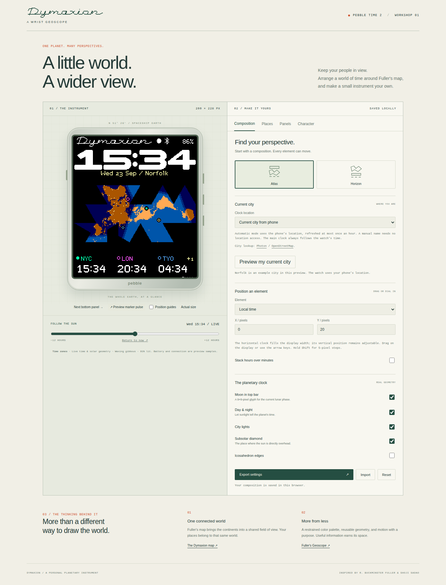
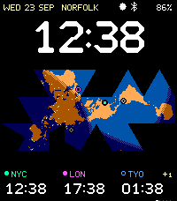
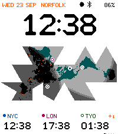
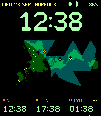
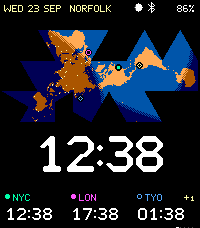

# Dymaxion

A flexible planetary watch face for **Pebble Time 2 / Emery**, with the original
concept's Dymaxion map, a full-width clock, and a browser layout workshop.



## On the watch

- Local time plus three independent clocks, with named IANA zones, daylight
  saving transitions, fractional-hour offsets, and date differences. A `+1`
  beside a zone means it is already tomorrow relative to the watch's local date;
  `−1` means yesterday, and the same date has no label.
- Explicit latitude/longitude for every place, with five small geometric map
  glyphs. Every place can have its own color, snapped to Pebble's 64-color grid.
  The local clock follows the watch; no location is guessed from an offset.
- **Meridian**, the default composition: a quiet status line (date, city,
  Moon, Bluetooth, battery) heads the face, 36-pixel **Chamfer**
  figures sit over the map, and the zones close the face. Chamfer is the Draft
  zone numerals at three times the size, every corner cut at 45°, so the big
  clock and the zone clocks are one design. See [Meridian](docs/MERIDIAN.md).
- Horizon puts the map on top and the clock beneath it. Every composition uses
  the status line; the map and places stay independently movable.
  Optional stacked hours/minutes retain the earlier display cut.
- A 400 ms minute transition for Chamfer and rounded broad numerals: only
  the map-scale triangles over changed figures shrink away to reveal the new time.
  Motion stops at 10% battery (adjustable) or when **Brief animations** is disabled.
  See [minute transitions](docs/MINUTE-FLIP.md).
- Pebble's own clock fonts as extra numeral styles: Leco, Bitham Bold, Bitham
  Light and Bitham Medium, with a pixel-exact workshop preview. Every style,
  including Span, gets the same minute transition. Leco Delta is Leco with every corner cut at 60°, to
  match the map's triangles.
- Rounded broad numerals and Span lettering remain available. Switch styles in
  **Character → Numerical display**. The triangular seven-segment experiment is
  retired; saved faces that used it open with Chamfer figures.
- An optional background behind the map, edge to edge and from the map's top
  to its bottom: the map's own triangle lattice split once, as **Triangle
  points** (a dot wherever the triangles meet), **Fine triangle points** (split
  once more) or **Triangle lines** (every edge dotted). It is baked into spare bits of the map data, so it costs the watch no
  memory. **Composition → The planetary clock → Map background**.
- An optional **Dymaxion nameplate**: the original pixel script, in the accent
  color, between the clock and the map: above the map in Meridian, under it in
  Horizon, where the clock moves down six pixels to make room.
  **Character → Dymaxion nameplate**.
- Your own location, from the phone, is marked with a bullseye one size up from
  the place glyphs, in the clock's ink. Places too close to tell apart (London,
  Paris and Berlin) are drawn side by side, west to east, in one shared clearing.
- Place times can also show outside the bottom panel, whenever it shows
  weather, tides or the calendar (or Quick View covers it), or always.
  **Character → Place times** and **Place times position**:
  - Beside the clock, left (default) or right: the figures shift aside and up
    to three places stack in the status-line capitals, with any day offset next
    to the place's label. Works with Chamfer and the Pebble system fonts; the
    minute transition is unchanged.
  - On the map: each time, in a tiny 3×5 pixel figure set, sits in the nearest
    open gap of the net, joined to its place by an outlined leader that leaves
    the glyph straight out and arrives straight on, centred, with 45° bends.
    Optionally turned 90° where that sits clearly closer. The watch places them
    itself, only when places or format change.
- The status line names the current city, using the phone's location at most
  hourly, or a manual name. The workshop labels Norfolk as an example until you
  request a location preview. City lookup uses Photon / OpenStreetMap.
- A small optional 9×9-pixel lunar glyph in the top bar, with eight familiar phases.
- Solar day/night shading, a small sun at the subsolar point, city lights and optional face edges.
- Fourteen RGB222 palettes, including **DaVinci**, **TWA**, **High Visibility**, **Monochrome**, **Blue & Amber**, **Teal & Rose**, **Amber Terminal**, and **Polar**. The six new palettes include matching bottom-panel colors and city glyphs, checked in color-vision simulations. Original **Dymaxion Span** clock numerals, **Draft** zone lettering, a seven-pixel Micro font, and a pixel-script nameplate. See [palette notes](docs/PALETTES.md).
- **Custom palettes** in Character and the phone configuration: copy any preset, edit colors with a live designer preview, and keep up to 12 named palettes. Colors include day/night map shades, lettering, indicators, default place colors, and chart/calendar defaults. Saved palettes travel with exported settings; the active colors persist on the watch.
- A typography study comparing Span, Draft, Alegreya Sans, Fira Sans, and Recursive at watch resolution, including lining and oldstyle figures where available.
- Five 5×5-pixel map glyphs in the Places tab: diamond, point, ring, triangle
  and plus. The place colors also carry through to the zone labels.
- A configurable 44-pixel bottom band: time zones, a weather chart, a two-week
  calendar, humidity, NOAA tide predictions and **Health**: today's steps per
  hour as bars, heart rate as a line and this weekday's typical steps dotted
  behind, with steps so far against a typical day in the corner. Health is
  read on the watch from Pebble Health and never leaves it. Choose the pages, their order,
  colors, units, chart scales and starting page in **Panels**.
- Optional buzz when the phone disconnects (and, if chosen, reconnects);
  silent in Quiet Time and at most once every two minutes on a flaky link.
- Quick View aware: when a timeline peek covers the bottom of the screen, the
  bottom band steps aside and the clock stays visible above the card.
- Optional wrist flicks to change panels (two by default, so the backlight
  flick alone does not), using Pebble's hardware tap detection (no
  accelerometer sampling). Disable it for a fixed page or timed rotation
  using the existing minute tick.
- The bottom tray swipes to its next page (300 ms). When the place times move
  beside the clock, the clock glides over and then the times fade in (500 ms),
  and the reverse on the way back (`shared/transitions.js`, `transitions.c`).
- **Power & motion** (Character): separate switches for the minute change and
  for the pulse and swipes; **Daylight updates** every 5, 10, 15 or 30 minutes;
  and a **Night saver** for the hours you choose, which reshades the map every
  other hour, stops animations and can **pause in the dark**: no redraws until
  you flick your wrist, the flick that turns on the backlight.
- A brief marker pulse, each place in turn, on launch and when the bottom panel returns to the time zones; real battery and a pixel
  Bluetooth connection indicator.
- Persistent configuration and an **offline phone settings page** included in
  the PBW. Hosting a website is not required to configure the watch.

| Meridian | Paper | Spaceship Earth | Horizon |
| --- | --- | --- | --- |
|  |  |  |  |

## Try the workshop

Requires Node.js 20.19+ (tested with 24) and npm.

```sh
npm ci
npm run dev
```

Open the local URL printed by Vite. Drag components directly on the watch, or
select an element and set its x/y coordinates. Arrow keys move the selected
element one pixel; Shift moves five. The solar slider previews a different time
without changing the watch's actual clock. Settings are saved in this browser.

Use **Export settings** to save a JSON file. In the face's settings inside the
Pebble phone app, open **Import settings from the workshop** and select that
file (or paste its JSON). Save to watch. You can also configure the face entirely
in the offline phone page, including exact positions and custom coordinates.

```sh
npm run build                  # static workshop in dist/
```

`dist/` may be hosted at any static-site path; assets use relative URLs. The
browser preview uses the same map resources and time-zone database as the watch
companion. Battery/connection values in the browser are explicitly sample values.
Bottom charts initially use labeled examples. **Load live data** fetches weather
for a configured place and tides for the selected NOAA station. The phone
companion only sends real provider data. See [bottom panels](docs/PANELS.md) for
the chart conventions, station coverage, caching and interaction details.

## Build and run the native face

Install the [Pebble SDK](https://developer.repebble.com/sdk/). Resources and the
generated phone companion are checked in, so an ordinary native build needs no
root npm install or Python asset tooling:

```sh
cd watchface
pebble build
pebble install --emulator emery  # add --vnc in a headless environment
# Or use your phone's developer connection:
pebble install --phone <phone-ip>
```

The installable file is `watchface/build/watchface.pbw`. Target: Emery only,
200×228 pixels, 64 colors. SDK 4.33.1 reports 100,924 bytes of resources and a
61,151-byte code/static-RAM footprint, leaving 69,921 bytes for the heap before
runtime allocations. The map bitmap and active clock resources use that heap.
See the [native power profile](docs/POWER-PROFILE.md) for measured rendering
costs, the animation optimization, and the assumptions behind the battery model.

The project also remains compatible with opening the `watchface` folder in the
[Pebble Browser Emulator](https://github.com/huntrontrakkr/pebble-browser-emulator).
That browser emulator integration has not been exercised in this revision.

## Development and verification

```sh
npm ci
npx playwright install chromium
npm run generate              # map, markers, palette, status, triangular display, caps, defaults
node tools/generate-chart-axis.mjs # compact chart numerals and layout constants
npm run generate:clock        # rounded pixel masters and native transition geometry
npm run generate:chamfer      # Chamfer masters, packed resource and native layout
npm run generate:system       # Pebble system-font preview glyphs and placement
npm run companion             # phone bundle, including offline configuration HTML
npm test                      # projection, DST, solar, providers, native packets/calendar/flick guard
npm run dev                   # keep running in another terminal
npm run test:browser          # desktop/mobile UI and simulated Pebble bridge
```

Typography preparation is separate. The Draft and Span generator verifies every glyph against its pixel master; the reference tool prepares the comparison families, and the workshop's wordmark has its own pixel drawing:

```sh
uv run --with fonttools==4.60.0 --with freetype-py==2.5.1 --with pillow==11.3.0 --with cairosvg==2.8.2 tools/generate-draft.py
uv run --with fonttools==4.60.0 --with freetype-py==2.5.1 tools/prepare-watch-type.py
uv run --with pillow==11.3.0 tools/generate-wordmark.py
npm run companion
```

The eight lunar phases and Bluetooth rune are drawn at their final pixel size
in `shared/` and packed into a native C table by `npm run generate:status`.
Rounded broad numerals animate only during their 400 ms minute transition;
there is no continuous animation or additional sensor.
Run `pebble clean` before building after changes to AppMessage keys or resources.

Tests require a host C compiler (`cc`). Playwright may require its documented
Linux runtime libraries. The current build has passed the core C/JavaScript
tests, browser suites and native Emery SDK emulator checks. The optimized
minute renderer also matches the previous renderer pixel-for-pixel across
252,384 sampled frames under memory and undefined-behavior sanitizers.
The [verification report](docs/POWER-PROFILE.md#method-and-validation) covers
all clock styles, partial redraws, overlapping animations, Quick View and
power-saving paths.
Physical hardware and an actual phone webview have not been tested.

| Source | Responsibility |
| --- | --- |
| `shared/map.js` | Preserved original Gray net and gnomonic coordinate mapping |
| `shared/markers.js` | Five original 5×5 map-glyph pixel masters and legacy-ID migration |
| `shared/settings.js` | Themes, presets (Meridian, Horizon), locations, bounds, validation |
| `shared/chamfer-numerals.js` | Chamfer figure masters (zone numerals ×3, 45° cuts) and clock strip |
| `shared/protocol.js` | Named time zones → compact native packet |
| `shared/solar.js` | Solar direction model used by the workshop |
| `shared/moon.js` | UTC lunar phase and eight native-size glyphs |
| `shared/status-glyphs.js` | Pixel Bluetooth connection rune |
| `shared/display.js` | Numeral styles and the display packet |
| `shared/map-background.js` | Triangle points and lines behind the map |
| `shared/zone-column.js` | Place times beside the clock (mirrored by `zone_column.c`) |
| `shared/health.js` | Health drawer layout (mirrored by `health.c`) and workshop example day |
| `shared/power.js` | Daylight update interval, animation switches and night saver (mirrored by `power.c`) |
| `shared/transitions.js` | Tray swipe and beside-the-clock transitions (mirrored by `transitions.c`) |
| `shared/nameplate.js` | The optional Dymaxion nameplate (mirrored by `nameplate.c`) |
| `shared/map-markers.js` | Close markers side by side (mirrored by `map_markers.c`) |
| `shared/map-times.js` | Place times on the map: tiny figures, placement and leaders (mirrored by `map_times.c`) |
| `shared/city.js`, `tools/location-service.js` | City naming, hourly reverse geocoding and offline cache |
| `shared/panel-*`, `shared/calendar.js` | Panel controls, provider normalization, packet contract and preview |
| `designer/` | Interactive preview, accessible controls, JSON import/export |
| `tools/mobile-config.*` | Offline phone settings page |
| `tools/companion.js` | Pebble bridge, persistence and retried synchronization |
| `tools/environment-service.js` | Weather/NOAA requests, caches and failure backoff |
| `tools/generate-*` | Reproducible map/font/data resources |
| `watchface/src/c/` | Native renderer, services and validated settings reader |

Read [the map-glyph notes](docs/MARKERS.md) for sizing, migration and color
rules, [the design and typography notes](docs/DESIGN.md) for research and current
bounds, and [the protocol notes](docs/PROTOCOL.md) for the
watch/phone contract. The default seed is January 2026; the companion refreshes
it with the current time and IANA data on connection. Its next eight transitions
keep each remote clock working offline. Expired transition caches show `?`.

## Map provenance and license

The original concept supplied by huntrontrakkr is the basis for the map, with
the exact vertex orientation, face table, canonical placements and split-face
selection retained. Land sampling is rebuilt from Natural Earth 1:110m data at
0.5-degree centers. This preserves the original **gnomonic approximation**, not
the exact Gray–Fuller within-face transform. Seventy-four major city lights from
the concept are retained in this first native version.

Fuller and Shoji Sadao are credited for the map; Robert W. Gray for the canonical
placement reference. The [Buckminster Fuller Institute](https://www.bfi.org/about-fuller/big-ideas/dymaxion-map/)
explains its intent. [Natural Earth](https://www.naturalearthdata.com/about/terms-of-use/)
data is public domain. Project code and the original fonts are
[Apache-2.0](LICENSE).
Bundled third-party notices are in [NOTICE](NOTICE).
