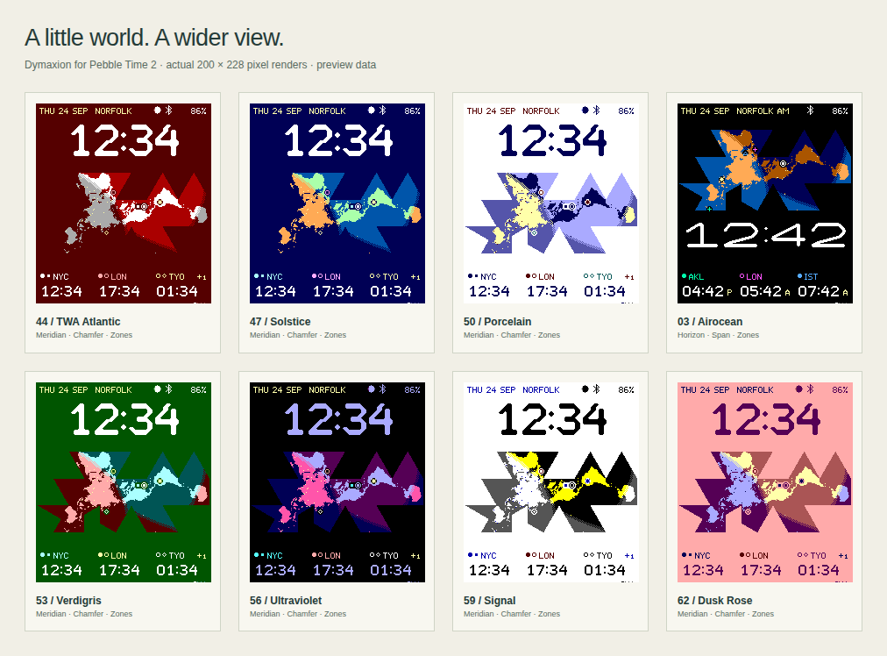

# Dymaxion

A small planetary instrument for **Pebble Time 2 / Emery**. A Dymaxion map
follows the sunlight around Earth, with your time, your places, and a window
on the day.

[**Download the watch face**](https://github.com/huntrontrakkr/dymaxion-watch-face/releases/latest/download/dymaxion.pbw)
· [**Open the workshop**](https://huntrontrakkr.github.io/dymaxion-watch-face/)
· [**Explore 70 faces**](https://huntrontrakkr.github.io/dymaxion-watch-face/gallery.html)

[](https://huntrontrakkr.github.io/dymaxion-watch-face/gallery.html)

## Make it yours

- **One connected world.** Solar day/night shading, night-side city lights,
  a moving sun, and small map markers for the places that matter to you.
- **Your time, and theirs.** A full-width clock and three independent IANA
  time zones, including daylight saving and fractional-hour offsets. A `+1`
  beside a place means tomorrow there; `−1` means yesterday.
- **23 palettes, eight clocks.** Original pixel lettering, Pebble system
  numerals, an optional script nameplate, and light, dark and high-contrast
  palettes. Create up to 12 of your own, with independent day/night shades,
  place colors and chart colors.
- **Two compositions.** Meridian places the clock above the map; Horizon
  places it below. Move the map and place labels, or put extra times beside
  the clock or directly on the map.
- **Six bottom panels.** Time zones, weather, a two-week calendar, humidity,
  NOAA tide predictions, and Pebble Health. Choose up to five, their order,
  colors, units and scales. Switch with optional wrist flicks, timed rotation,
  or leave one in place. Health data stays on the watch.
- **Small details, considered.** Current city, date, lunar phase, Bluetooth
  and battery in the top line. Optional 400 ms minute transitions, separate
  motion controls, adjustable daylight updates, and a night saver.

The [70-face gallery](https://huntrontrakkr.github.io/dymaxion-watch-face/gallery.html)
covers every palette, clock style and panel, with downloadable settings for
every image. All previews use the actual 200×228, 64-color renderer. Weather,
tides, Health and device-status values shown in the gallery are examples.
[View the complete contact sheet](docs/screenshots/gallery-all.png).

## Install and configure

Download **dymaxion.pbw** from the [latest release](https://github.com/huntrontrakkr/dymaxion-watch-face/releases/latest).
This build targets **Emery only**. With the [Pebble SDK](https://developer.repebble.com/sdk/)
installed and the phone's [Developer Connection](https://developer.repebble.com/guides/tools-and-resources/developer-connection/)
enabled, install the downloaded file with:

```sh
pebble install --phone <phone-ip> dymaxion.pbw
```

Open Dymaxion's settings in the Pebble phone app to configure it. The settings
page is bundled in the watch-face package and works offline; weather, tides
and city lookup need a connection to refresh.

For a larger preview, use the [workshop](https://huntrontrakkr.github.io/dymaxion-watch-face/).
Choose **Export settings**, then **Import settings from the workshop** in the
phone settings, load the JSON and **Save to watch**. Gallery layouts use the
same import. Per-place colors and custom panel colors override palette defaults;
choose **Use theme color(s)** to follow the selected palette again.

## Build and explore

The workshop requires Node.js 20.19+; Node 24 is used for verification.

```sh
git clone https://github.com/huntrontrakkr/dymaxion-watch-face.git
cd dymaxion-watch-face
npm ci
npm run dev
```

For the native face, install the Pebble SDK, then:

```sh
cd watchface
pebble build
pebble install --emulator emery
```

Generated resources are checked in. See the [development guide](docs/DEVELOPMENT.md)
for asset generation, tests, gallery captures and source structure.
Read about [palettes](docs/PALETTES.md), [bottom panels](docs/PANELS.md),
[the Meridian composition](docs/MERIDIAN.md), [minute transitions](docs/MINUTE-FLIP.md)
and [native rendering performance](docs/POWER-PROFILE.md).

Verified with automated C/JavaScript and browser tests and the native Emery SDK
emulator. Physical hardware and an actual phone webview have not been tested;
the power profile is an emulator-based model, not a measured battery-life claim.

## Map and credits

The original concept supplied by huntrontrakkr provides the map's vertex
orientation, canonical placements and split-face selection. It preserves a
**gnomonic approximation**, rather than the exact Gray–Fuller within-face
transform, with Natural Earth 1:110m land sampled at 0.5-degree centers and
74 major city lights.

Credit to Buckminster Fuller and Shoji Sadao for the map, and Robert W. Gray
for the placement reference. The [Buckminster Fuller Institute](https://www.bfi.org/about-fuller/big-ideas/dymaxion-map/)
describes its intent. [Natural Earth data](https://www.naturalearthdata.com/about/terms-of-use/)
is public domain. Project code and original fonts are [Apache-2.0](LICENSE);
third-party credits are in [NOTICE](NOTICE).
