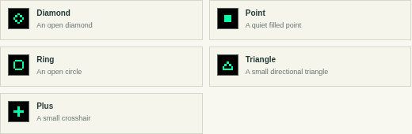

# Map glyphs

Twelve 5×5-pixel glyphs distinguish places on the Dymaxion map: five simple
cartographic marks and seven notation and bookkeeping marks, with no literal
depiction of Fuller's buildings or ideas.
The small scale gives the map room to remain the subject.

| ID | Glyph | Shape |
| ---: | --- | --- |
| 0 | Diamond | Open diamond |
| 1 | Point | Filled 3×3 point |
| 2 | Ring | Open circular form |
| 3 | Triangle | Upright triangular outline |
| 4 | Plus | Small crosshair |
| 5 | Dagger | Footnote dagger † |
| 6 | Double dagger | Second footnote ‡ |
| 7 | Asterisk | Note mark * |
| 8 | Pilcrow | Paragraph mark ¶ |
| 9 | Check | Tick ✓ |
| 10 | Cross | Cross-out ✗ |
| 11 | Number | Number sign # |

The section sign §, reference mark ※, asterism ⁂ and therefore sign ∴ were
tried and left out: at five pixels they read as an S, a blur or stray dots.

The subsolar point has its own 5×5 glyph (`SUN_ROWS` in
`shared/status-glyphs.js`): a small sun, a 3×3 orb with eight single-pixel
rays, on the same 7×7 clearing as the place glyphs.

Each tracked place can select any glyph and its own color. The color picker
rounds to Pebble's 64-color RGB222 palette. “Use theme color” returns a place
to the current theme default. The same color appears on the map glyph, zone
label, daylight dot and short launch/settings pulse.

The six palettes starting with High Visibility also draw the chosen 5×5 glyph
beside its city label, in addition to the day/night dot. Match glyph shapes
between map and clocks when colors look alike. Default places use distinct
shapes; choosing distinct glyphs keeps custom place colors unambiguous too.

The glyphs are drawn at native resolution in `shared/markers.js`; the generator
packs the same pixels for the watch in `watchface/src/c/generated/markers.h`.
Older saved compositions with the previous 21-icon set migrate to the nearest
geometric mark while retaining location, time zone, placement and color. New
exports include `markerSet: 2`. Settings packet v7 carries the selected ID and
color in the existing 232-byte packet. See the [protocol notes](PROTOCOL.md).
