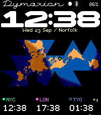
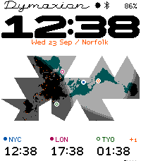

# Meridian and the Chamfer figures

September 2026. Meridian is the default composition for new installs; Atlas and
Horizon remain one tap away, and saved faces keep exactly what they had.

| Previous default (Atlas, broad numerals) | Meridian (Chamfer figures) |
| --- | --- |
|  |  |
|  |  |

## What was wrong

The map was right. The trouble was everything competing with it.

- **Too many voices.** The top 60 pixels held a 1950s script nameplate, an
  ultra-extended arcade numeral, and a mixed-case caption with oldstyle
  figures: three typographic eras in one glance.
- **Numerals stretched to fill the width.** Filling 196 pixels with four
  32-pixel figures made them twice as wide as they are tall. Eight-pixel
  horizontals left four-pixel slits for counters, so 3, 5, 6 and 8 read as
  blocks. The full-foot 1 left a hole in any time that contains it.
- **The clock outranked the map.** A clock drawn to fill the width became the
  loudest thing on the face, and the map read as a picture between two labels.

## What changed

**Chamfer figures.** The best numerals on the face were already there: the
Draft zone clocks along the bottom. Chamfer is that drawing at three times the
size. Every exposed pixel corner is cut on a clean 45° line and every inside
step is filled on the same diagonal, so the enlargement reads as a drawn,
angular figure rather than a blown-up bitmap. The big clock and the three zone
clocks are now one design at two sizes.

**Smaller on purpose.** The figures are 36 pixels tall and 27 wide, set in
fixed tabular cells across 134 pixels of the 200-pixel width. The map is the
largest thing on the face again, and it stays where Atlas has always put it.

**A status line instead of a nameplate.** The watch does not need to say its
own name. Date and city move to the top line in Draft Micro's lining capitals,
beside the Moon, Bluetooth and battery marks that were already there. The
caption row under the clock disappears.

**Still the same instrument.** The same map, palettes, places, panels,
settings and 400 ms minute transition (now a shrink of map-scale triangles). Chamfer fits the original Atlas and Horizon
positions, with the caption 12 pixels below the figures when the nameplate is
shown; switching numerals keeps whichever composition you are in.

## Engineering notes

- The clock strip is 200 × 40 pixels: figures from y=24 to 60 in Meridian,
  colon squares with the same cut corners. The minute transition uses one row
  of 36-pixel triangles over the figures, and only the tiles over changed
  figures move.
- `tools/generate-chamfer-clock.mjs` reads the zone masters from
  `tools/draft-lettering.py`, cuts them geometrically (8 × 8 samples per
  pixel), and packs the masters and transition lattice into a 2,350-byte resource.
- Pebble limits an app's static image to 64 KB and the face was already at
  62.8 KB. Chamfer's resource and the status-line capitals (1,602 bytes) load
  into the heap only when used; the transition buffers (4,068 bytes for Chamfer) moved
  from static memory to the heap for both faces. An ARM cross-compile of the app
  sources measures 17,167 bytes *less* static memory than before.
- The watch finds lattice cells by binary search over per-row runs instead of
  a lookup table. Host tests compare native frames, read from the packed
  resource, with the browser at every sampled stage of seven transitions, and
  the status-line capitals pixel for pixel.
- Display code 4 is Chamfer; code 3 remains the retired LCD style, which the
  watch still migrates to broad. Flag 64 in the settings packet is the status
  line.

## Reproduce

```sh
npm run generate:chamfer           # masters, resource, native layout
npm run generate                   # includes the status-line capitals
node output/meridian/capture.mjs   # with npm run dev running
```

Physical hardware and the SDK emulator have not been run for this revision;
see the README for what has been verified.
