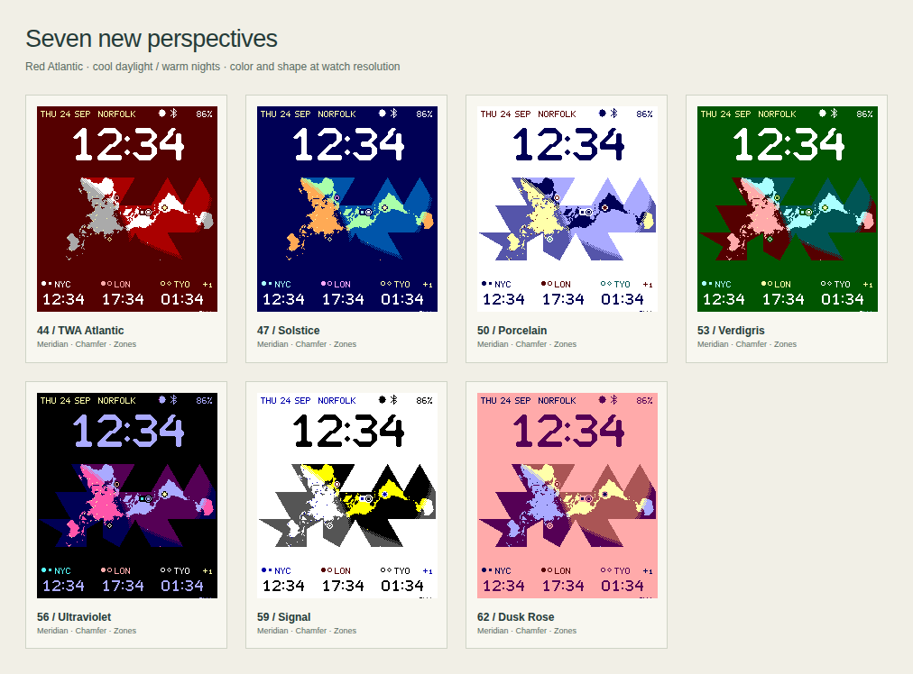
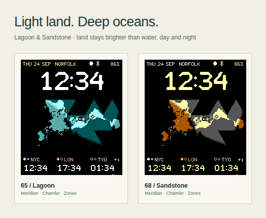

# Watch palettes

Choose a palette in the workshop's **Character** tab or the phone's **Theme**
selector. All colors are authored directly on Pebble's 64-color RGB222 grid.
These are color treatments; the pixel typefaces and map geometry stay the same.

## Custom palettes

In **Character → Custom palettes**, choose **New custom palette** to copy the
current preset or saved palette. Give it a name and edit the background,
lettering, and highlights while watching the live preview. Expand the additional
groups to edit day/night land and ocean, map edges, default place colors, moon
shadow, and chart/calendar colors. Color picks snap to the
nearest color the Pebble can display.

Keep up to 12 named palettes. The designer saves edits locally as you make them;
switching to a preset retains the saved library. Creating a new palette while a
custom palette is selected makes an independent copy. **Delete palette** removes
the selected custom palette and returns to the current preset.

The same editor is available in the phone configuration. Use **Save to watch**
there to apply changes. **Export settings** in the designer includes the whole
palette library; import that JSON in either interface to transfer or restore it.
Per-place colors and the panels' **Custom colors** setting take priority over
palette defaults. Choose **Use theme color(s)** in those controls to inherit the
active palette again. Map glyphs beside city names can also be enabled in a
custom palette, independently of its base preset.

The companion sends only the active colors to the watch in an 18-byte `PALETTE`
packet, alongside the existing `SETTINGS`, `FOOTER`, and `DISPLAY` packets in one
message. Preset IDs remain unchanged. The packet contains version, base preset,
enabled flag, city-glyph flag, 13 RGB222 colors, and a reserved byte. The watch
validates and persists it at key 4; preset selection explicitly disables it.
Old companions that send only preset settings clear a previous custom override.
The library remains on the phone and in exported settings. This adds no timers,
network requests, or bitmap resources.

## Presets

| Wire ID | Name | Character |
| --- | --- | --- |
| 0 | Airocean | Blue ocean, amber continents, white figures |
| 1 | Blueprint | Cobalt ground and cool drafting ink |
| 2 | Paper | White ground, black figures, teal land |
| 3 | Spaceship Earth | Deep green ocean and luminous green land |
| 4 | DaVinci | Warm yellow paper, brown ink, earth pigments, red chalk |
| 5 | TWA | White ground, deep red figures, vivid red land, silver-gray ocean |
| 6 | Earthrise | Midnight blue, ivory land and figures, copper annotations |
| 7 | Sea Glass | Pale aqua ground, deep teal figures, muted water, rose accents |
| 8 | High Visibility | Yellow figures on black, white/gray map, bright labels |
| 9 | Monochrome | White ground, black figures, neutral map and panels |
| 10 | Blue & Amber | Near-black blue ocean, amber land, white figures |
| 11 | Teal & Rose | Dark teal ocean, light rose land, white figures |
| 12 | Amber Terminal | Black ground, amber figures, ivory land |
| 13 | Polar | White ground, navy figures, cyan land and deep teal ocean |
| 14 | TWA Atlantic | Red seas, white continents, silver-gray land at night |
| 15 | Solstice | Green land and blue water by day, burnt-orange land and warm lights at night |
| 16 | Porcelain | White ground, navy land, periwinkle water and ivory nights |
| 17 | Verdigris | Forest ground, mint and teal daylight, coral and burgundy nights |
| 18 | Ultraviolet | Black ground, lilac figures, plum seas and rose nights |
| 19 | Signal | White ground, black figures and water, yellow land, blue annotations |
| 20 | Dusk Rose | Rose paper, plum figures, ivory land and lilac nights |
| 21 | Lagoon | Pale aqua land over deep teal seas; quieter turquoise land over black at night |
| 22 | Sandstone | Cream land over charcoal seas; burnt-orange land over black at night |

DaVinci takes its material cues from Leonardo's pen-and-ink drawings, including
[Notes on the wind](https://www.rct.uk/collection/912672/notes-on-the-wind).
The deliberately limited watch colors suggest paper and brown ink without
adding a texture that would interfere with small lettering.

TWA draws on the red-and-white graphics of its
[September 1955 timetable](https://collection.sfomuseum.org/objects/1762693653/)
and the red stripes, white fuselage, and silver surfaces seen in a
[late-1950s Starliner model](https://collection.sfomuseum.org/objects/1763278801/).
It is an original color treatment inspired by those objects; no logo or artwork
has been copied into the face.

TWA Atlantic reverses the original TWA palette's map emphasis: red belongs to
the ocean, with white daylight continents and gray night continents. Solstice
uses the same solar terminator to shift cool green/blue daylight into warm
burnt-orange land and pale gold lights. Its night water deepens to black so the
darker brown-orange coastlines remain distinct. Verdigris, Porcelain and Ultraviolet also use
distinct day/night hues. These follow sunlight at each map pixel, independently
of the wearer's local time; enable **Day/night shading** to see both treatments.

Lagoon and Sandstone keep land brighter than the ocean on both sides of the
terminator. Lagoon pairs pale aqua with deep teal; Sandstone pairs cream with
charcoal. Both soften the continents at night over black water, retaining
clear coastlines without a bright night glow.

The [70-face gallery](https://huntrontrakkr.github.io/dymaxion-watch-face/gallery.html)
includes three configurations for each of the 23 palettes, plus the default face.
Each image has an importable settings file.

`shared/palettes.js` is the palette source. Every theme includes the daylight
and night map colors, lettering, annotations, three default place colors, moon
shadow, and a retired inactive-segment color, still carried in the palette
packet for compatibility but no longer drawn or edited. The minute transition uses only each
palette's ink and ground. Independent custom place colors retain
their existing settings. New palettes provide chart and calendar defaults;
custom panel colors are retained until **Use theme colors** is selected.

The original IDs and default selection are retained. The generators export the
native theme count, watch palette tables and moon colors; the companion bundles the same definitions for offline configuration.
The palette additions add no timers, graphics resources, or network requests.
Current native build measurements are in the [development guide](DEVELOPMENT.md).

## Color-vision review

High Visibility and Monochrome prioritize luminance. Blue & Amber avoids
red/green pairing; Teal & Rose offers a different hue relationship. Amber
Terminal and Polar provide warm-dark and cool-light alternatives. A single
palette cannot predict every person's experience, so all six preserve strong
light–dark differences and repeat each map glyph beside its city label. This
follows [W3C's guidance to provide information beyond color](https://www.w3.org/WAI/WCAG22/Understanding/use-of-color.html).
The existing day/night dot remains, and weather uses a line for temperature and
bars for rain. Daylight also has a solid/dotted treatment.

`tools/color-vision.mjs` checks linear-light sRGB using severity-1 matrices from
[Machado, Oliveira & Fernandes](https://doi.org/10.1109/TVCG.2009.113), verified
against the [Colour implementation's dataset](https://github.com/colour-science/colour/blob/develop/colour/blindness/datasets/machado2010.py).
Protan, deutan, tritan and grayscale previews are available in the six-palette
comparison. These approximate different color-vision conditions; they do not
model an individual or the reflective watch display under every light.

Tests require at least 7:1 for the clock, captions, default place labels and
panel colors against the background, and 3:1 between map land and ocean on
both sides of the terminator, in every preview mode. The text target follows
[W3C's enhanced contrast guidance](https://www.w3.org/WAI/WCAG22/Understanding/contrast-enhanced.html).
For the six palettes from High Visibility through Polar, the lowest measured
text contrast is 7.46:1 and coastline contrast is 3.35:1, recorded in
`output/accessibility-palettes/contrast.json`. The nine palettes from TWA
Atlantic through Sandstone meet the same checks: their minima are 7.06:1 for
text and 3.35:1 for coastlines, recorded in [the new palette report](new-palette-contrast.json).
All fifteen repeat each map glyph beside its city label.
These are checks of the authored colors, not a WCAG certification of the watch.
Custom colors can reduce contrast, so the figures apply to preset defaults.

The comparison uses real 200×228 canvas renders, with sample weather and tide
curves clearly labeled as examples. Physical-watch readability and feedback
from people with different color vision remain useful next checks.
