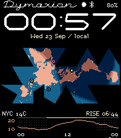
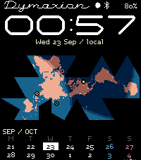
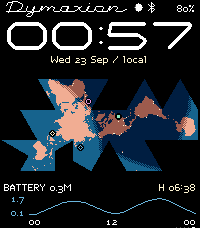

# Bottom panels

The bottom 44 pixels (rows 184–227) show one page at a time. The map, large clock,
Moon and Bluetooth indicator keep their existing positions. The **Panels** tab
in the workshop and the offline phone settings expose the same controls.

The reference was [ForecasWatch 2](https://github.com/mattrossman/forecaswatch2),
including its native Emery screenshot, calendar renderer and configuration.
Its colored temperature/rain chart, night treatment, highlighted today and
weekend colors informed this smaller implementation. We use two calendar rows,
one primary chart line, short rain bars and time labels spaced to fit the width.
No ForecasWatch code, fonts or assets are copied.

## Chart spacing and lettering

The second pass reviewed the actual ForecasWatch 2 renderer at
[`2ee7ad2`, `forecast_layer.c`](https://github.com/mattrossman/forecaswatch2/blob/2ee7ad2992b58986efbd1eca995c588005d6ae5c/src/c/layers/forecast_layer.c).
Its side-label strip grows from measured text width; hour-label frequency comes
from available chart width, and Emery gets distinct major/minor ticks. Those
layout principles are adapted here to our much shorter 44-pixel panel.

Range labels and hour labels share an original four-pixel-wide,
seven-pixel-high numeral cut, with compact minus signs, decimal points and A/P
marks, in the ink color rather than the series color. Headings and calendar
dates use Draft Micro's lining capitals, the same cut as the status line, so
every panel figure sits on the baseline. All text is whole pixels, with no
font scaling or antialiasing.

Rain probability or amount is drawn behind the temperature line, one RGB222
step toward the ground, so the temperature line leads; the header names the
peak. Humidity joins the same chart as a dotted line in the humidity color on
its own fixed 0–100% scale (it has no range labels; the header reads it out),
so temperature, humidity, rain and daylight share one timeline. It can be turned
off in the weather settings. Tides stay on their own panel. Night carries a dotted field and a grey daylight strip, shaded per pixel
column from the sun's altitude at the wearer's position (the phone's rounded
location; the forecast place when there is none, such as a manual city). The
edges fall at the actual sunrise and sunset (-0.833°), and the header's RISE/SET
time comes from the same calculation (`shared/solar.js`,
`watchface/src/c/solar.c`), so the label and the shading always agree.

The left gutter measures both range labels, allowing two pixels of outer padding
and three before the plot. A normal two-digit temperature scale needs 14 pixels
instead of the old fixed 29. Negative values and tide decimals reserve their
actual width; hiding range labels reduces the inset to two pixels.

With a two-digit range, the plot is 184 × 22 pixels rather than 167 × 20, about
21% more plotting area inside the same footer. A quiet baseline has hourly
minor ticks and longer ticks beneath labeled hours. Normal 12/24/48-hour views
with a 24-hour clock label every 2/3/6 hours: seven/nine/nine labels instead of
three. AM/PM labels reserve more width. Narrower or partial data windows choose
spacing from the available width and the measured numeral cut. Label boxes stay
inside the display and retain at least two pixels between neighboring labels.
Each label uses the local hour supplied with its sample, including DST repeats
and jumps. No additional provider samples or refreshes are needed.

`shared/chart-axis.js` defines the pixel cut and browser layout; the generator
exports its glyphs and constants to `generated/chart_axis.h`. Native layout and
formatting live in `chart_axis.c`. Tests compare both implementations across
signed temperatures, tide decimals, partial horizons, 12/24-hour clocks and
midnight. The before/after comparison uses clearly labeled sample data.

Watch graphics render into a fixed 200 × 228 buffer. The browser and native
watch share the same stored clock pixels and status masks; circles and marker
pulses use discrete pixel drawings. Preview enlargement uses whole multiples,
with its origin aligned to physical browser pixels. Chart lines and ticks use
opaque one-pixel strokes; the preview does not smooth or requantize them.

Native Emery screenshots, with actual forecast and NOAA response data:

| Weather | Calendar | Humidity | NOAA tide |
| --- | --- | --- | --- |
|  |  |  |  |

| Page | Display | Configuration |
| --- | --- | --- |
| Time zones | Existing three place clocks | Places and layout controls remain available |
| Weather | One chart: temperature line, dotted humidity line (fixed 0–100%), dimmed precipitation bars, daylight strip/night dots; header gives temperature, humidity and next rise/set | Place, °C/°F, 12/24/48 hours, probability/amount/off, mm/in, rain scale, automatic/fixed temperature range, refresh interval |
| Calendar | Weekday labels and fourteen dates, with today highlighted | Sunday (default), Monday or Saturday start; previous/current or current/next week; weekend pattern in one weekend color; optional public holidays for the United States (federal, observed dates), Canada, Mexico, the United Kingdom (England and Wales), Germany, France or Australia; filled/outlined today |
| Humidity | Relative humidity alone (not in the default rotation; the weather chart carries it) | Fixed 0–100% or fitted range; uses the weather location and cache |
| Tide | Predicted water-height curve and next high/low time (optional: not in the default rotation; switch it on in the panel list. NOAA predictions are fetched only while it is included) | NOAA station, station time zone, meters/feet, automatic/fixed scale, zero line |

Chart range labels, faint midline and colors are configurable. Colors follow
the active theme by default; every light-ground palette and the six palettes
beginning with High Visibility include their own chart and calendar colors, at
7:1 contrast or better against the ground. Saturday and Sunday share the
weekend color (the packet still carries a separate Sunday slot for older
exports; it is not drawn). Editing a color retains the entire
current set as custom colors, so a later palette change preserves it. **Use
theme colors** resumes following the palette. Old exports with edited panel
colors remain custom. All colors snap to RGB222.

The page dots along the last row show the selected page. Chart hour
labels and rise/set times follow the forecast location; H/L times follow the
NOAA station. Calendar dates follow the watch's own local date. Temperature and
humidity headings show the current hourly forecast sample, not a live sensor.

Custom layouts should leave the bottom band free when panels are enabled. The
Meridian and Horizon presets already do. Disabling panels restores the place
clocks without reserving that band.

## Changing pages and battery use

Choose any one to five pages, reorder them, and select a starting page. A
wrist flick changes the page: by default two quick flicks, because a single
flick is also the watch's motion-backlight gesture and glancing at the watch in
the dark should not change what it shows. One or three flicks can be chosen
instead. Flicks use Pebble's accelerometer tap service, a hardware interrupt:
nothing samples the accelerometer and the watch does not wake between flicks,
so it stays on at any battery level. Taps closer than 250 ms are one flick (a
flick can register on several axes); each further flick must follow within
0.9 s, and a page change is followed by a one-second rest (`panel_tap`). The tap service unsubscribes when flicks are
disabled, when there is only one page or when panels are disabled.

Other periodic work is kept small. The map is relit every five minutes, not
every minute (the terminator moves about a pixel in that time), and the weather
chart's sunrise/sunset shading and header time are cached until the chart
window or the next event moves.

For no panel changes by motion, disable flicks and use a fixed page or timed
rotation (1, 2, 5, 10, 15, 30 or 60 minutes). Rotation uses the existing minute
tick. A manually changed page restarts the interval. The workshop's **Next
bottom panel** button previews the same order.

Holding Back was ruled out after checking the [Pebble click API](https://developer.repebble.com/docs/c/User_Interface/Clicks/):
a native watchface cannot subscribe to button clicks, and Back has a system
role. The face remains a watchface.

## Providers and offline behavior

[Open-Meteo](https://open-meteo.com/en/docs) provides temperature, relative
humidity, precipitation probability/amount, daylight flags, sunrise and sunset.
It uses the explicit latitude/longitude and IANA zone of the selected place.
No GPS permission or API key is required. The default refresh is one hour;
30 minutes, two hours and three hours are available. Data attribution and
service terms are in [NOTICE](../NOTICE).

[NOAA CO-OPS](https://api.tidesandcurrents.noaa.gov/api/prod/) provides hourly
harmonic predictions and high/low events. Requests use UTC and metric MLLW
(mean lower low water); display conversion happens locally. Predictions refresh
every six hours. Eleven presets cover selected U.S. coastal locations, Alaska,
Hawaii and Puerto Rico. A custom harmonic station ID, label and IANA time zone
can be entered. Choose a station explicitly; geographical proximity alone does
not establish tidal equivalence. Subordinate stations that only supply high/low
events cannot supply this hourly curve and show an unavailable state. These are
astronomical predictions, not observed water levels or storm-surge forecasts.

The phone caches 49 hourly samples per provider and the watch persists compact
copies. A minute tick advances through those samples without fetching each
minute. Unit/color/scale changes reuse the cache. Requests only run for enabled
data pages; failures back off for five minutes. Changing location or station
invalidates the prior cache and discards any late response for that location.
An unchanged packet does not rewrite watch storage.

A failed refresh keeps valid cached samples and marks the chart **OLD**.
Age also marks weather old after twice its refresh interval and tides after
12 hours. Once fewer than two samples remain, **FORECAST EXPIRED** replaces the
curve. Missing values are rejected instead of becoming zero-temperature,
zero-rain or zero-tide samples. No configured tide station produces **CHOOSE A
NOAA STATION**. A missing first response produces **WAITING FOR PHONE** or
**DATA UNAVAILABLE**.

The workshop starts with clearly labeled **DEMO** curves to make layout editing
possible offline. **Load live data** replaces them with provider responses.
The companion never supplies those examples to the watch.

## Verification

Automated checks cover settings migration, packet validation, missing hourly
values, cache reuse/backoff, late responses, fractional-hour forecast locations,
calendar parity between JavaScript and C across DST/leap/year boundaries, and
the wrist-flick guard. Browser checks cover the default pages, live-response
fixtures, page order, timed rotation, persistence, unit conversion and mobile
layout. An earlier revision was verified in the Emery emulator (AppMessage
delivery, rendered pages, and the since-replaced shake detector); the wrist-flick
version has not yet run in the emulator or on hardware. Real requests were also checked
for New York, Kathmandu and NOAA station 8518750 (The Battery).

Physical wrist-motion sensitivity, power consumption and phone webview behavior
still need hardware testing. The [accelerometer API](https://developer.repebble.com/docs/c/Foundation/Event_Service/AccelerometerService/)
documents the available sampling rates and batching. U.S. observed holiday
rules follow the [OPM calendar](https://www.opm.gov/policy-data-oversight/pay-leave/federal-holidays/).
Other regions mark national public holidays on their calendar dates (fixed
dates, nth-weekday rules and Western Easter offsets); substitute weekdays and
state or provincial holidays are not shown. Browser and watch agree on every
holiday from 2024 through 2030 in host tests.
